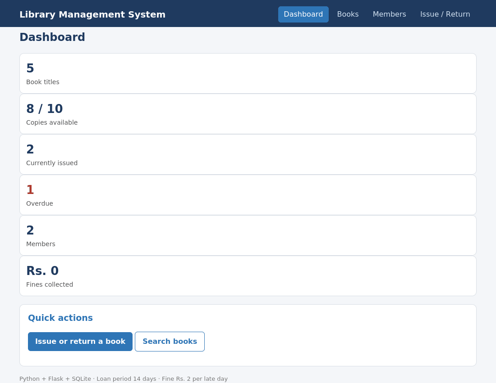
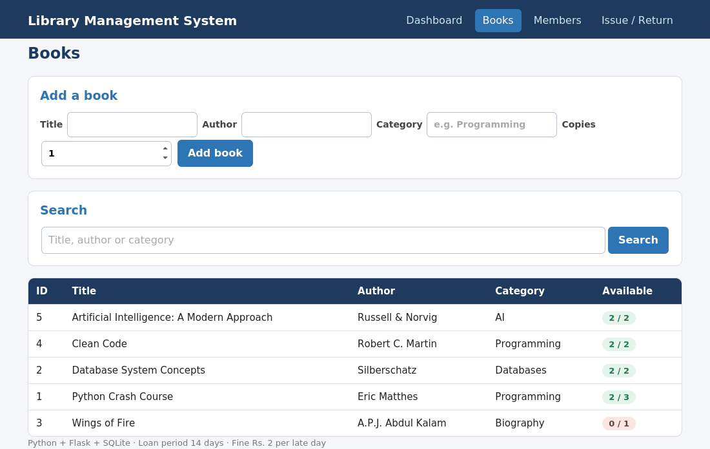
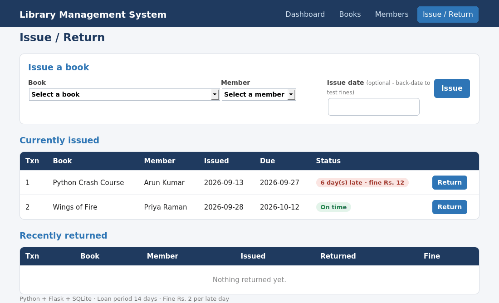

# Library Management System

A library management system built with **Python** and **SQLite**, with both a **web interface** (Flask) and a **console menu**.
Developed by Deepika V, B.Tech CSE (AIML), St. Joseph's Institute of Technology.



## Features

- Add books and search by title, author or category
- Register members (unique email)
- Issue books (14-day loan) and return them
- Automatic late fine of **Rs. 2 per day**
- Stock is updated on every issue and return; no issuing when no copies are left; a return can only happen once
- Dashboard with totals, overdue count and fines collected
- Reports of issued books and inventory

## Quick start

```bash
git clone https://github.com/deepikavadivel93-afk/Library-Management-System.git
cd Library-Management-System
pip install -r requirements.txt

python app.py              # web app  ->  open http://127.0.0.1:5000
python library_system.py   # console menu (needs no extra packages)
python demo.py             # scripted demo that prints sample output
```

On the web dashboard click **Load sample data** to try it straight away. One sample book is already overdue so you can see the fine calculated when you press **Return**. On the Issue / Return page you can also back-date the issue date to test fines.

## Run the tests

```bash
python -m unittest discover -s tests -v
```

## Project structure

```
library_system.py   core logic: Library class + console menu (SQLite)
app.py              Flask web interface
templates/, static/ HTML pages and CSS
demo.py             non-interactive demo
tests/              unit tests (logic + web routes)
docs/               project report (PDF) and screenshots
```

## Database

| Table | Purpose |
|-------|---------|
| `books` | title, author, category, copies, available |
| `members` | name, unique email |
| `transactions` | book, member, issue/due/return dates, fine |

The database file (`library.db`) is created automatically on first run. Set `LIBRARY_DB` to use a different file.

## Screenshots

| Books | Issue / Return |
|-------|----------------|
|  |  |

## Documentation

The full project report is in [`docs/Library_Management_System_Project_Report.pdf`](docs/Library_Management_System_Project_Report.pdf).

## License

MIT - see [LICENSE](LICENSE).
